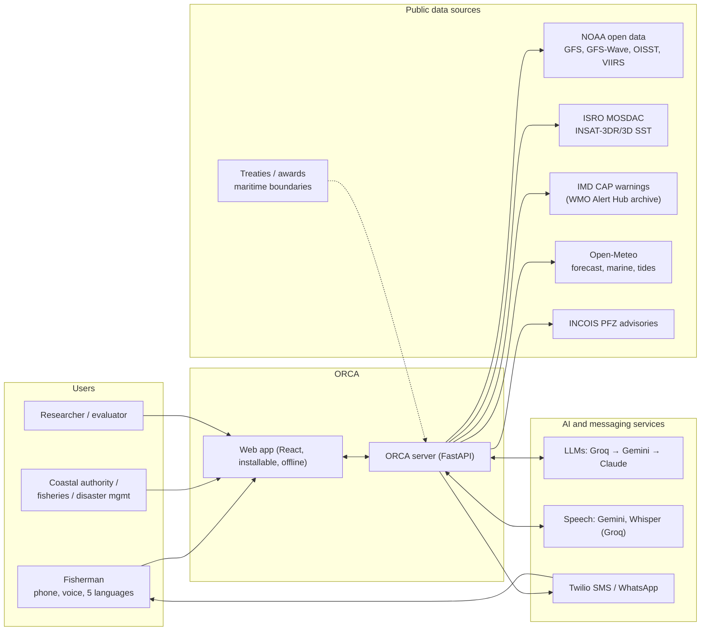
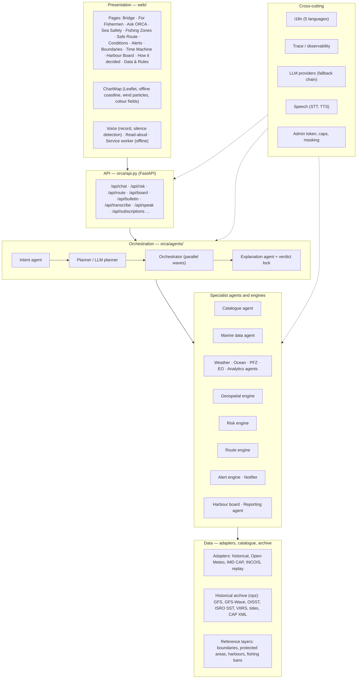
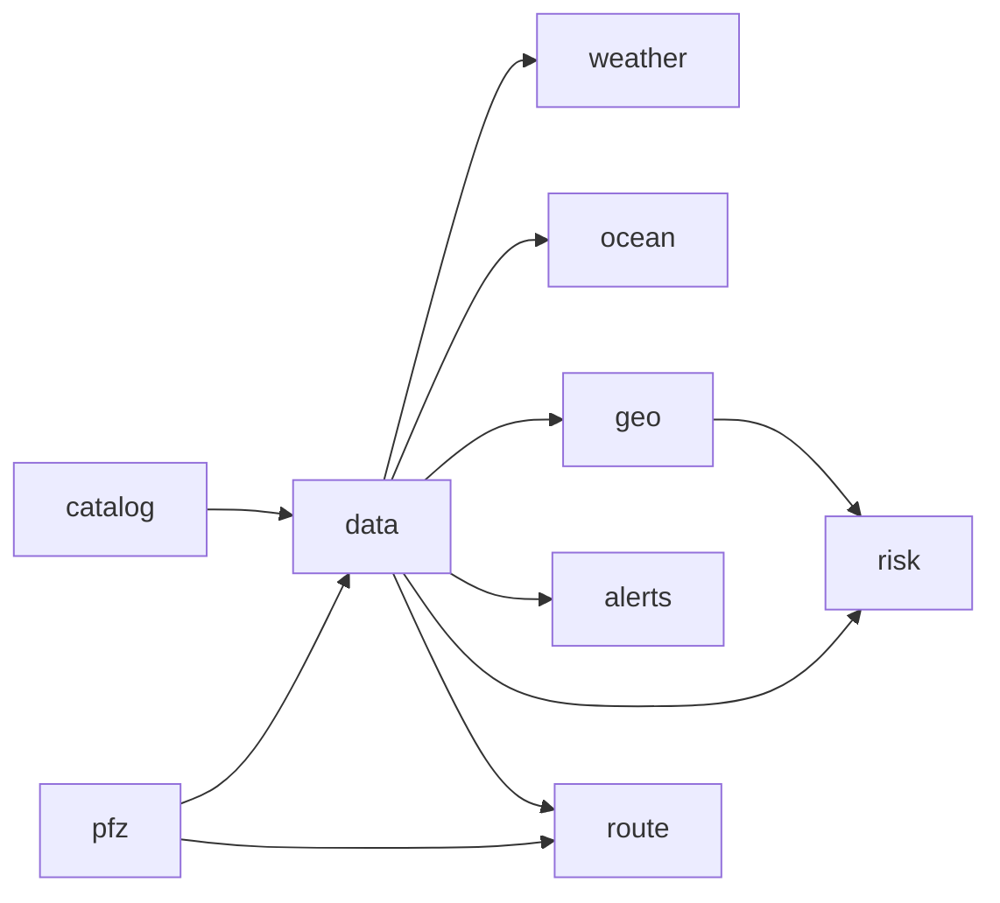

# ORCA — Technical approach and architecture

ORCA (Marine EcOsystem Reasoning with Collaborative Agents) is an agentic, multilingual decision-support platform for
Indian fishermen and coastal authorities, built for Smart India Hackathon 2026, problem statement 26176 (ISRO /
Department of Space). This document explains **how** ORCA answers a question, **why** it is built that way, and
**where** each part lives in the code.

Contents

1. [Approach](#1-approach)
2. [System context](#2-system-context)
3. [Layered architecture](#3-layered-architecture)
4. [Request lifecycle](#4-request-lifecycle)
5. [Agents and engines](#5-agents-and-engines)
6. [Planning: fixed planner and LLM planner](#6-planning-fixed-planner-and-llm-planner)
7. [Data layer](#7-data-layer)
8. [Decision engines](#8-decision-engines)
9. [The language model layer](#9-the-language-model-layer)
10. [Languages and voice](#10-languages-and-voice)
11. [Delivery channels](#11-delivery-channels)
12. [Verification and evaluation](#12-verification-and-evaluation)
13. [Security and privacy](#13-security-and-privacy)
14. [Deployment and configuration](#14-deployment-and-configuration)
15. [HTTP API](#15-http-api)
16. [Repository layout](#16-repository-layout)
17. [Limitations and next steps](#17-limitations-and-next-steps)

---

## 1. Approach

### The problem, restated

A fisherman asks, in his own language, *"Is it safe to go out tomorrow morning?"*. A correct answer needs forecasts for
every hour of the trip, satellite ocean data, official warnings, maritime boundaries and protected areas, and it must be
explained in words he trusts. A coastal officer needs the same answer for every harbour at once. Both need to know
*why*, and both need to know when ORCA **cannot** tell.

### Design principles

| Principle | What it means in ORCA |
|---|---|
| **Rules decide, the AI explains** | Safety verdicts come only from a versioned, cited rule set (`risk/rules.py`). Language models plan tool calls and phrase answers; a *verdict lock* discards any LLM text that changes the verdict or quotes a number that is not in the data. |
| **Hour by hour, not "now"** | Every hour of the requested window is assessed; the answer names the hour risk changes, the cause, and the lowest-risk window. |
| **Evidence for every number** | Each value carries source, product, data type (observation / forecast / derived / official advisory / simulated), valid time and reference, and is shown in "Why?". |
| **No look-ahead on real history** | Demonstrations replay real archived events; at each replay moment ORCA may only use what had been published by then. |
| **Honest gaps** | Missing data gives *NOT SURE* (`INSUFFICIENT_DATA`), never a guessed *LOW*. A place outside the loaded data is said to be outside it. |
| **Degrade, never fail** | Every agent can fail without taking the request down; every LLM call has a deterministic fallback; live sources fall back to labelled alternatives. |
| **Built for the user at the jetty** | Voice in and out, five Indian languages, one big GO / DON'T GO answer, SMS/WhatsApp alerts, an installable app that works offline. |

### What is agentic here

ORCA shows the agentic properties the problem statement asks for, and keeps each one accountable:

- **Autonomous planning** — a planner decomposes a question into a dependency graph of agent steps; for questions the
  fixed planner cannot express (comparisons, "which harbour is safest", several places), an LLM plans tool calls from a
  typed menu.
- **Tool selection and discovery** — a catalogue agent decides which datasets can answer *here and now*, including a
  live search of ISRO's MOSDAC archive.
- **Collaboration** — specialist agents run in parallel waves and pass results along the dependency graph.
- **Explainable decisions** — every request produces a trace of the plan, each step, the data used and the rule version.

---

## 2. System context



---

## 3. Layered architecture



**Why a modular monolith.** One Python process holds every agent as a module with a narrow interface
(`AgentResult(value, summary, sources)`). That keeps a hackathon system easy to run (one command, runs offline on the
archive) while the boundaries — adapters, agents, engines, providers — are the seams along which it would split into
services later.

---

## 4. Request lifecycle

### Steps

```
 1 receive question            POST /api/chat {message, session_id, lat, lon, language?}
 2 detect language             i18n/detect.py — Unicode script, Hindi vs Marathi markers, romanized Hindi
 3 resolve context             agents/context.py — session state: place, window, selected zone, language, speed
 4 extract entities            agents/intent.py — coordinates, harbour names (all 5 scripts), IST time words, duration
 5 plan                        agents/planner.py (dependency graph) — or agents/llm_planner.py for comparisons
 6 discover data               catalog.py — which datasets cover this place and time; live ISRO MOSDAC search
 7 retrieve + validate         data_service.py + adapters — normalized MarineObservation, plausibility flags
 8 build marine state          state.py — hour-indexed observations + warnings containing the point
 9 analyse in parallel         weather, ocean, geospatial, PFZ, EO, analytics agents (asyncio waves)
10 decide                      risk/engine.py (rules orca-rules-0.2.1) · route/planner.py · geo/geofences.py
11 assemble                    cards, map features, evidence (with provenance), coverage gaps
12 explain                     agents/explanation.py — LLM + verdict lock, or checked templates
13 respond                     answer + cards + map + evidence + trace (ChatResponse)
14 save state                  place, window, zone, language, intents for the follow-up question
```

### Sequence

```mermaid
sequenceDiagram
  autonumber
  participant U as User (web / voice)
  participant API as FastAPI /api/chat
  participant I as Intent agent
  participant PL as Planner
  participant C as Catalogue agent
  participant D as Marine data agent
  participant AG as Specialist agents
  participant E as Engines (risk, geo, route)
  participant X as Explanation agent
  participant L as LLM (Groq→Gemini→Claude)

  U->>API: question (+ location, language)
  API->>I: detect language, intents, entities
  I-->>API: parsed (rules; LLM only if rules find nothing)
  API->>PL: build plan (dependency graph)
  PL->>C: which datasets cover here and now?
  C-->>PL: sources, gaps, ISRO granules (MOSDAC search)
  PL->>D: retrieve for the window
  D-->>PL: MarineState (observations + warnings)
  par parallel wave
    PL->>AG: weather, ocean, PFZ, EO
  and
    PL->>E: geofence, risk trajectory, route
  end
  E-->>PL: RiskDecision (verdict, change points, windows)
  PL->>X: validated results
  X->>L: evidence packet (JSON schema)
  L-->>X: draft answer
  X->>X: verdict lock (level, ids, numbers, safety words)
  X-->>API: answer (LLM or template)
  API-->>U: answer, cards, map, evidence, trace
```

---

## 5. Agents and engines

| Component | File | Kind | Responsibility | Decides safety? |
|---|---|---|---|---|
| Intent agent | `agents/intent.py` | tool (LLM fallback) | language, intents, entities | No |
| Planner | `agents/planner.py` | engine | intents → dependency-ordered steps, context rules | No |
| LLM planner | `agents/llm_planner.py` | LLM agent (validated) | tool calls for comparisons / multi-harbour questions | No |
| Catalogue agent | `catalog.py`, `specialists.catalog_agent` | tool agent | which datasets cover the place and time; published yet; ISRO MOSDAC search; gaps | No |
| Marine data agent | `specialists.discover_marine_data` | tool agent | fetch + normalize via adapters, record data status | No |
| Weather agent | `specialists.weather_agent` | tool agent | wind, gusts, thunderstorm hours, visibility, rain | No — evidence |
| Ocean agent | `specialists.ocean_agent` | tool agent | waves, swell, SST, currents, tide turning points | No — evidence |
| PFZ agent | `pfz.py`, `historical/pfz.py` | tool agent | INCOIS advisories or zones derived from SST fronts + chlorophyll; ranked, reachable within 150 km | No — evidence |
| EO / satellite agent | `specialists.eo_hotspots` | tool agent | chlorophyll hotspots and SST fronts | No — evidence |
| Ocean analytics agent | `specialists.productivity_agent` | tool agent | recent vs earlier SST and chlorophyll | No — evidence |
| Geospatial engine | `geo/geofences.py`, `geo/regulations.py` | engine | point-in-polygon, boundary side, approach distance, fishing bans | Hard constraints |
| Risk engine | `risk/engine.py`, `risk/rules.py` | engine | versioned rules, hour-by-hour trajectory, windows | **Yes** |
| Route engine | `route/planner.py` | engine | time-dependent A* with explicit cost vs direct line | **Yes** (feasibility) |
| Alert engine | `alerts.py` | engine | re-evaluate watches, vessel geofencing, SSE push | **Yes** (triggering) |
| Notifier | `notify.py` | delivery | SMS / WhatsApp to subscribed phones | No |
| Harbour board + reporting agent | `board.py` | engine + template agent | every harbour for a window; bulletin in 5 languages | Uses the risk engine |
| Explanation agent | `agents/explanation.py` | LLM agent (locked) | phrase results in the user's language | No — verdict lock |
| Speech | `speech.py` | tool | speech-to-text, text-to-speech | No |

The trace labels every step with its kind (`llm-agent`, `tool-agent`, `deterministic-engine`), so the interface never
presents a rule engine as "AI" or the other way round.

---

## 6. Planning: fixed planner and LLM planner

### Fixed planner (`agents/planner.py`)

Turns intents and resolved context into a dependency graph. Typical safety question:



Resolution rules: location = coordinates in the message > harbour named > "there" (zone from the previous answer) >
device GPS > conversation context. Window = explicit time words > previous window on a follow-up > now to +6 h.

The orchestrator (`agents/orchestrator.py::run_plan`) runs every step whose dependencies are met, in parallel waves
(`asyncio.gather`). A failed step marks its dependants as skipped; the request still answers with what succeeded.

### LLM planner (`agents/llm_planner.py`)

Used when a question names two or more harbours, or asks for a comparison ("which is safest", "compare", and the same
words in Hindi, Tamil, Telugu and Malayalam) — and is not a route, zone, hotspot, productivity, avoid or alerts question,
which the fixed planner handles.

| Stage | Detail |
|---|---|
| Tool menu | `harbour_safety(harbour, day, part)`, `nearest_zone(harbour)`, `warnings(harbour)` |
| Output contract | strict JSON schema: `{goal, steps[{tool, harbour, day, part}]}`; `day ∈ {today, tomorrow}`, `part ∈ {now, morning, afternoon, evening, night}` |
| Validation | unknown tool → rejected; unknown harbour → rejected; bad time → rejected; duplicates dropped; at most 8 steps; every rejection is recorded in the plan notes |
| Fallback | no LLM, or no valid step → a rule plan: `harbour_safety` for each harbour named, at the time asked |
| Execution | the tools are ORCA's deterministic engines (`assess_window`, PFZ ranking, warnings); run in parallel |
| Answer | assembled from checked templates in the user's language; the safest harbour is the lowest level (never one ORCA cannot confirm) |

Example: *"Which harbour in Karnataka is safest tomorrow morning?"* — the LLM chooses Karwar, Malpe and Mangaluru; ORCA
checks each and answers that none is safe, with each harbour's deciding factor.

---

## 7. Data layer

### Data modes

| Mode | Marine data | Warnings | Clock |
|---|---|---|---|
| `historical` (default) | NOAA GFS / GFS-Wave runs as issued, ISRO INSAT SST (when downloaded), NOAA OISST, VIIRS chlorophyll, harbour tides | IMD CAP messages as sent + model cyclone watch (derived, not scored) | the event's replay moment; fast-forward moves it |
| `live` | Open-Meteo weather + marine | IMD CAP feed | wall clock |
| `auto` | live first, simulated scenario on failure (labelled) | IMD CAP feed | wall clock |
| `replay` | simulated scenario (tests, offline demo) | scenario warnings | wall clock + offset |

Everything above the adapters is identical in every mode: agents, engines and the UI never branch on where data came
from, only on its labels (`data_type`, source, published time).

### Adapters

`adapters/base.py` defines `capabilities() / fetch() / normalize() / health()`. Adapters return `MarineObservation`
objects (id = provenance id, source, product, position, retrieved and valid time, data type, variable, value, unit,
quality flag, resolution, processing version, reference). `variables.py` applies plausibility ranges and quality flags.

### Catalogue and discovery (`catalog.py`)

Before any data is fetched the catalogue agent answers: *which datasets can answer here and now?* For each source it
reports `covers`, `outside`, `not_published`, `not_downloaded`, `found_on_mosdac`, `not_found` or `unchecked`, with a
detail line, and it lists gaps. It also searches ISRO's MOSDAC archive live (public OpenSearch, no login, cached, 6 s
timeout) for INSAT-3DR/3D daily and half-hourly SST covering the point and day.

The gap `outside_replay` is stated to the user in every language and leads the answer, because it explains *why* ORCA
cannot confirm safety there.

### Historical archive (`historical/archive.py`)

Each event (`historical/events.py`: Cyclone Tauktae 2021, Cyclone Michaung 2023, a calm January 2024 week) is stored as
compact int16 grids in `backend/data/historical/<event>/`, so the app runs offline. Every product has a publication rule:

| Product | File | Visible at replay moment T when… |
|---|---|---|
| GFS 0.5° / GFS-Wave 0.25° | `gfs_atmos.npz`, `gfs_wave.npz` | the run's files were on NOAA's server (S3 upload time) by T |
| NOAA OISST v2.1 daily SST | `sst.npz` | day + 1 day 12 h ≤ T |
| ISRO INSAT-3DR/3D L3B daily SST | `isro_sst.npz` | day + 1 day 6 h 15 min ≤ T (window closes 00:15 next day, +6 h margin) |
| VIIRS chlorophyll composite | `chl.npz` | the composite's last day has passed |
| IMD CAP warnings | `cap/*.xml` | the message's sent time ≤ T |
| Harbour tides | `tide.npz` | always (astronomical, predicted in advance) |

**Coverage rule.** Every grid answers only inside its own area (half a cell beyond the outer centres). A point outside
an event's archive gets no value — the risk engine then says *cannot confirm* — never the nearest edge cell's value from
somewhere else.

### ISRO satellite data (MOSDAC)

`scripts/historical/fetch_mosdac.py` uses the same API as MOSDAC's official client:

| Step | Endpoint | Auth |
|---|---|---|
| Search | `GET https://mosdac.gov.in/apios/datasets.json?datasetId&startTime&endTime&boundingBox` | none |
| Token | `POST https://mosdac.gov.in/download_api/gettoken {username, password}` | MOSDAC account |
| Download | `GET https://mosdac.gov.in/download_api/download?id=<record id>` | Bearer token |

Products: `3RIMG_L3B_SST_DLY` (INSAT-3DR), falling back to `3DIMG_L3B_SST_DLY` (INSAT-3D); one granule per day, highest
product version. Following the INSAT-3D Data Products Format Document, the reader takes the 2-D `Latitude` /
`Longitude` datasets (int16 with `scale_factor`, `add_offset`, `_FillValue`) and the `SST` dataset, keeps only
`SST_QFLAGS = 3` (high confidence), converts Kelvin to °C, and averages pixels onto a regular 0.05° grid over the event
region. The server itself never needs an HDF5 library.

The historical adapter prefers ISRO SST wherever it has a cloud-free value and falls back to NOAA OISST elsewhere.

### Tides (`scripts/historical/fetch_tides.py`)

Hourly `sea_level_height_msl` from the Open-Meteo Marine API at each harbour's sea point in the event region. Before
that record starts (Tauktae, 2021), tides are predicted by harmonic analysis: six constituents (M2, S2, N2, K1, O1, Q1)
fitted by least squares on January–March 2023 and evaluated at the replay dates; such tides are labelled *derived*.
`tide_at()` uses the nearest harbour within 60 km.

### Reference layers (`geo/data/geofences.json`)

| Layer | Source | Accuracy label |
|---|---|---|
| India–Sri Lanka boundary, Palk Strait and Gulf of Mannar | 1974 Agreement Art. 1 (positions 1–6); 1976 Agreement Art. 1 (1m–13m), UN DOALOS treaty texts | official (checked point by point) |
| India–Sri Lanka boundary, Bay of Bengal | 1976 Agreement Art. 2 (1b, 1ba, 1bb, 2b–6b) | official |
| India–Bangladesh boundary | 2014 Bay of Bengal Maritime Boundary Arbitration award, Delimitation Points 1–3 + azimuth 177° 30′ to the Bangladesh/Myanmar line | official |
| Marine protected / sensitive areas | Gulf of Mannar MNP, Malvan, Gulf of Kachchh MNP, Gahirmatha (seasonal) | approximate |
| Restricted area off Goa | fictional, for the demo | fictional-demo |

Boundary lines carry a *home side*; the side test uses the nearest segment's cross product. Fishing bans
(`geo/regulations.py`) apply the annual seasonal bans: east coast 15 April – 14 June, west coast 1 June – 31 July.

---

## 8. Decision engines

### Risk rules (`risk/rules.py`, version `orca-rules-0.2.1`)

| Factor | LOW | MODERATE | HIGH | SEVERE | Reference |
|---|---|---|---|---|---|
| Significant wave height | < 1.25 m | 1.25–2.5 m | 2.5–4 m | ≥ 4 m | WMO sea-state code 3700 |
| 10 m wind | < 29 km/h | 29–39 km/h | 39–62 km/h | ≥ 62 km/h | Beaufort scale |
| Visibility | ≥ 3.7 km | 1–3.7 km | < 1 km | — | marine forecast visibility terms |
| Thunderstorm (codes 95/96/99) | — | — | HIGH | — | WMO code table 4677 |
| Official warning (CAP severity) | Minor | Moderate, Unknown | Severe | Extreme | issuing agency (IMD) |

Official warnings that name a coast also cover points within 50 km of their polygon (IMD's coastal polygons can stop
tens of kilometres offshore). Model-derived cyclone watches are shown but not scored.

### Risk engine (`risk/engine.py`)

- **Per hour:** classify each scored factor, add thunderstorm and warning factors, take the worst.
- **Missing wave or wind:** `INSUFFICIENT_DATA`, unless another factor is already HIGH or SEVERE.
- **Window:** the worst hour decides, and any gap makes the window *cannot confirm* unless HIGH/SEVERE is already known.
- **Output:** change points (time, direction, cause), go windows (LOW), caution windows (≤ MODERATE), key factors,
  evidence ids and uncertainty notes (lead time > 72 h, forecast vs observation, derived, simulated, gaps).
- **Hard constraints:** inside a restricted/protected area, beyond a boundary, or a fishing ban in effect. These are
  reported separately and never softened.

### Route engine (`route/planner.py`)

- Grid over the start–end bounding box (about 50 × 50 nodes), 8-connected, time-dependent A*.
- Edge cost = travel time × (1 + w[risk level at the time the boat reaches that edge]); w: LOW 0, MODERATE 1,
  INSUFFICIENT_DATA 3.
- Forbidden: HIGH and SEVERE at arrival time, land (GLOBE mask sampled about every 1 km), restricted / protected /
  sensitive polygons, boundary crossings.
- The direct line is always evaluated and shown; the recommended route is smoothed only when the shortcut is no riskier.
- A route's worst level treats data gaps as *cannot confirm*, never LOW.

### Fishing zones (`historical/pfz.py`, `pfz.py`)

Candidate zones where a sea-surface-temperature front meets chlorophyll-rich water; thresholds are percentiles, cells
within 10 km of land are skipped (turbid water). Zones beyond 150 km of the user's harbour are not viable ("beyond a
fishing trip's range"). In live mode INCOIS PFZ advisories are used when available.

### Alerts (`alerts.py`)

Watches keep their last level and warning ids. Re-evaluation (background loop, on demand, or after a replay
fast-forward) raises `risk_increase`, `risk_high` (first evaluation) and `new_advisory`; vessel tracking alerts once per
geofence status change. Alerts are pushed by Server-Sent Events and to registered listeners (the SMS/WhatsApp
notifier).

---

## 9. The language model layer

### Providers (`llm/providers.py`)

| Provider | Model (default) | Use |
|---|---|---|
| Groq | `openai/gpt-oss-120b` | first choice (fast) |
| Google Gemini | `gemini-2.5-flash` | automatic fallback when Groq fails or is rate-limited |
| Anthropic Claude | configurable | optional third provider |

`provider_from_env()` chains every provider with a key (`FallbackProvider`). All calls request strict JSON-schema
output. Provider error text (which can name the account) stays in the server log, never in user-facing notes.

### Where the LLM is used — and where it is not

| Use | Guard |
|---|---|
| Intent fallback when the rule parser finds nothing | output validated field by field |
| Planning comparison questions | tool menu + validation + rule-plan fallback (§6) |
| Phrasing the answer | verdict lock (below); template fallback |
| Deciding safety, routes, alerts | **never** |

### Verdict lock (`agents/explanation.py`)

An LLM answer is discarded (and the checked template answer used) if:

1. its `risk_level` differs from the engine's level (the safety verdict, else the conditions trend it was shown);
2. it cites an evidence id that is not in the packet;
3. it contains a number that is neither a packet value nor a packet value rounded to the precision written
   (34.47 → "34" is allowed; "35" is not). Numbers from the user's own question are not evidence;
4. it claims safety ("it is safe", "safe to go") when the level is HIGH, SEVERE or cannot confirm.

For HIGH, SEVERE and cannot-confirm verdicts, the fixed advice sentence leads the answer in the user's language whatever
the LLM wrote, and a coverage gap sentence leads it when the place is outside the loaded data.

---

## 10. Languages and voice

- **Detection** (`i18n/detect.py`): Unicode script, with markers to tell Hindi from Marathi and romanized Hindi.
- **Answers** (`i18n/messages.py`): every template in English, Hindi, Tamil, Telugu and Malayalam; other languages
  through the LLM with a note.
- **Harbour names** (`geo/ports.py`): aliases in all five scripts, so "கோவா மற்றும் கார்வார்" finds Goa and Karwar.
- **Speech-to-text** (`speech.py`, `POST /api/transcribe`): the browser records, converts to 16 kHz mono WAV
  (`web/src/audio.ts`) and uploads; the server tries Gemini first, then Whisper on Groq. In ORCA's tests Gemini
  transcribed Hindi, Tamil and Malayalam exactly; Whisper was faster but wrote Malayalam in the Gurmukhi script.
- **Voice interaction** (`web/src/ui/voice.ts`): one tap; a live bubble with a level meter appears at once; about 1.4 s
  of silence ends the question and it is sent automatically; live words are previewed where the browser can.
- **Text-to-speech** (`POST /api/speak`): phones often lack Tamil, Telugu and Malayalam voices, so the server reads the
  verdict aloud with Gemini's speech model (WAV, cached). The page uses the phone's own voice when it has the language
  and prefetches server audio otherwise.

---

## 11. Delivery channels

| Channel | For | Where |
|---|---|---|
| **For Fishermen page** | one verdict (GO / GO WITH CARE / DON'T GO / NOT SURE), reason, best time, come-back time, waves and wind in words, warnings, compass to the nearest reachable zone, read aloud, Coast Guard 1554 and 112 | `web/src/pages/Fishermen.tsx` |
| **Ask ORCA** | multi-turn conversation, voice, maps, harbour comparisons | `web/src/pages/Ask.tsx` |
| **Feature pages** | Sea Safety, Fishing Zones, Safe Route, Conditions, Alerts, Boundaries, Time Machine | `web/src/pages/` |
| **Harbour Board** | every harbour for a window, grouped; bulletin in 5 languages to copy, print or share on WhatsApp | `web/src/pages/Board.tsx`, `board.py` |
| **SMS / WhatsApp alerts** | a phone subscribed to a harbour receives every alert for it, in its language | `notify.py`, `POST /api/subscriptions` |
| **Installable app, offline** | manifest + service worker; network-first for pages and answers with saved copies when offline; hashed assets cached | `web/public/manifest.webmanifest`, `web/public/sw.js` |
| **Transparency** | How it decided (plan, steps, datasets found), Data & Rules (sources, rule table) | `Agents.tsx`, `Data.tsx` |

**Interface design.** A "chart room" identity (paper chart by day, ECDIS-style night palette) with a shared design
layer (`web/src/sonar.css`): the ORCA mark, a nautical icon set with per-icon motion, tide-fill buttons, sonar ripples,
page emblems and chart crop marks. All motion is disabled under `prefers-reduced-motion`.

**Messaging.** `notify.py` sends through Twilio (SMS, and WhatsApp via Twilio's WhatsApp sender) when credentials are
set, otherwise into an outbox (`GET /api/outbox`) so the flow can be shown end to end. Messages reuse the alert engine's
localized text, shortened for SMS.

---

## 12. Verification and evaluation

### Backtest (`scripts/historical/backtest.py`)

ORCA's evening verdict for 06:00–12:00 IST next morning (from the GFS run published by 21:30 IST) scored against ECMWF
ERA5 at 12 west-coast harbours, 1 May – 15 June 2021 (Cyclone Tauktae and the monsoon onset):

| | ORCA | Persistence ("tomorrow = this evening") |
|---|---|---|
| Harbour-mornings | 552 | 552 |
| Dangerous (HIGH/SEVERE) in ERA5 | 48 | 48 |
| Caught | **42 (87.5%)** | 37 (77.1%) |
| Missed | 6 | 11 |
| False alarms (share of danger calls) | 28.8% | 7.5% |
| Exact level | 82.2% | 90.4% |

ORCA catches more dangerous mornings at the cost of more false alarms — the right side to err on for a safety tool.

### Other checks carried out

| Check | Result |
|---|---|
| Harmonic tide prediction vs real Open-Meteo sea level (fit Jan–Mar 2023, predict Dec 2023, 12 harbours) | RMSE 0.08–0.27 m on tidal ranges 0.6–2.9 m; correlation 0.85–0.93 |
| India–Bangladesh line: bearing of the southern leg vs the award | 177.51° vs 177.50° |
| India–Sri Lanka points vs treaty texts | all match; one missing point (2m) found and added |
| Speech-to-text engines on Hindi, Tamil, Malayalam, English clips | Gemini exact on all; Whisper wrong script for Malayalam |
| End-to-end voice (fake microphone in Edge) | question sent in 9–13 s after one tap; answer in the same language |

### Automated tests

`backend/tests/` — 151 tests covering adapters, the risk engine, geofences and routes, the orchestrator and verdict lock,
the LLM planner's validation, the catalogue agent and coverage rule, the ISRO reader (on a file built to the documented
layout), tides, the harbour board and bulletin, the notifier (including a simulated Twilio), speech endpoints and the
admin gate. Run with `pytest` in `backend/`. The web build type-checks with `tsc` (`npm run build`).

---

## 13. Security and privacy

| Concern | Measure |
|---|---|
| Shared controls (replay clock, event, re-evaluation, outbox, subscription list) | `ORCA_ADMIN_TOKEN` gate (`X-Orca-Admin-Token` header) when set |
| Resource growth | caps: 500 watches, 5000 tracked vessels, 1000 subscriptions, 8 MB audio, 600-character speech |
| Phone numbers | memory only, never logged, masked in every response (`+91••••••3210`) |
| API keys | `backend/.env` (git-ignored); never in code or responses |
| Provider errors | account details kept in server logs, not user-facing text |
| LLM safety | verdict lock; the LLM never decides safety |
| Static files | path-traversal guard on the single-page-app route |

---

## 14. Deployment and configuration

```powershell
cd backend
python -m venv .venv; .venv\Scripts\activate
pip install -r requirements.txt
cd ..\web; npm install; npm run build
cd ..\backend; uvicorn orca.api:app --port 8000      # http://localhost:8000
```

`docker compose up --build` runs the same on port 8000. Re-downloading archives needs `pip install -r
requirements-data.txt`, then `scripts/historical/fetch.py`, `fetch_tides.py` and (with a MOSDAC account)
`fetch_mosdac.py`.

Key settings (full table in the README; example in `.env.example`):

| Variable | Purpose |
|---|---|
| `ORCA_DATA_MODE`, `ORCA_REPLAY_EVENT` | data mode and replay event |
| `GROQ_API_KEY`, `GEMINI_API_KEY`, `ANTHROPIC_API_KEY`, `ORCA_LLM_PROVIDER` | language models and their order |
| `MOSDAC_USERNAME`, `MOSDAC_PASSWORD`, `ORCA_MOSDAC_SEARCH` | ISRO download and live search |
| `TWILIO_ACCOUNT_SID`, `TWILIO_AUTH_TOKEN`, `TWILIO_SMS_FROM`, `TWILIO_WHATSAPP_FROM` | SMS / WhatsApp |
| `ORCA_ADMIN_TOKEN` | protect shared controls |
| `ORCA_ALERT_INTERVAL_S` | background alert re-evaluation period |

---

## 15. HTTP API

| Method | Path | Purpose |
|---|---|---|
| POST | `/api/chat` | conversation → `ChatResponse` (answer, cards, map, evidence, trace) |
| GET | `/api/risk?lat&lon&start&end` | structured risk decision |
| GET | `/api/conditions?lat&lon&hours` | hourly series of every variable + hourly levels |
| GET | `/api/pfz?lat&lon` | ranked fishing zones |
| POST | `/api/route` | route comparison |
| GET | `/api/geofence/check?lat&lon` | geofence status |
| GET | `/api/board?day&part` | harbour board |
| GET | `/api/bulletin?day&part&language` | bulletin text + board |
| POST | `/api/transcribe?language` | audio body → text + detected language |
| POST | `/api/speak` `{text, language}` | WAV of the text read aloud |
| POST / DELETE | `/api/subscriptions`, `/api/subscriptions/{id}` | SMS / WhatsApp alert subscriptions |
| GET | `/api/subscriptions`, `/api/outbox` | subscriptions and sent messages (admin, numbers masked) |
| GET / POST / DELETE | `/api/alerts`, `/api/alerts/watch`, `/api/alerts/evaluate`, `/api/alerts/stream` | alerts and SSE |
| POST | `/api/track` | vessel position → geofence alert |
| GET | `/api/layers/risk`, `/api/layers/fields` | map overlays |
| GET | `/api/replay/events`, `/api/replay/timeline`; POST `/api/replay/event` | historical replay |
| POST | `/api/sim/advance`, `/api/sim/reset` | replay clock (admin) |
| GET | `/api/geofences`, `/api/advisories`, `/api/ports`, `/api/rules`, `/api/backtest` | reference data |
| GET | `/api/health`, `/api/traces`, `/api/traces/{id}` | health, providers, traces |

Interactive documentation: http://localhost:8000/docs.

---

## 16. Repository layout

```
backend/
  orca/
    api.py                 FastAPI app and endpoints
    services.py            wiring: data service, providers, replay context
    catalog.py             catalogue + discovery (incl. MOSDAC search)
    board.py               harbour board + bulletin (reporting agent)
    notify.py              SMS / WhatsApp notifier
    speech.py              speech-to-text, text-to-speech
    alerts.py              alert engine
    agents/                intent, planner, llm_planner, orchestrator, specialists, explanation, context
    adapters/              historical, Open-Meteo, IMD CAP, replay; base interface
    historical/            events, archive (no-look-ahead reads), derived PFZ, map layers
    risk/                  rules (versioned), engine
    route/                 time-dependent A*
    geo/                   geofences, ports, land mask, geometry, regulations; data/geofences.json
    i18n/                  language detection, messages in 5 languages
    llm/                   providers and fallback chain
  scripts/historical/      fetch.py, fetch_mosdac.py, fetch_tides.py, backtest.py
  data/historical/<event>/ archived grids, tides, CAP XML, meta.json
  tests/                   pytest suite
web/
  src/pages/               one page per feature (incl. Fishermen, Board)
  src/ui/                  ChartMap, Chat, voice, Icon, Navbar, Splash, fx
  src/sonar.css            design layer
  public/                  manifest, service worker, icons, land mask
docs/                      this document, data sources, requirements mapping, demo script
```

---

## 17. Limitations and next steps

| Area | Status | Next step |
|---|---|---|
| ISRO SST reader | built to ISRO's format document and tested on a synthetic file; real files need a MOSDAC login | download with a MOSDAC account; `fetch_mosdac.py --inspect` confirms the layout |
| ISRO chlorophyll (Oceansat-3 OCM) | not integrated (dataset ids not confirmed) | add once MOSDAC ids are confirmed |
| Lightning | thunderstorms derived from model fields (labelled) | IMD Damini / lightning network access |
| India–Pakistan boundary | not drawn — no agreed boundary (Sir Creek) | authoritative layer from NHO / MoES |
| India–Maldives boundary | not drawn — treaty text not in the online archive | add from the 1976 agreement |
| Protected areas | approximate extents | MoEFCC / WDPA polygons |
| Storage | in-memory (sessions, watches, subscriptions, traces) | PostgreSQL + PostGIS, Redis |
| Translations | author-written in 5 languages | native-speaker review before field use |
| Risk thresholds | cited public scales mapped to levels as a prototype policy | validation with INCOIS / IMD |
